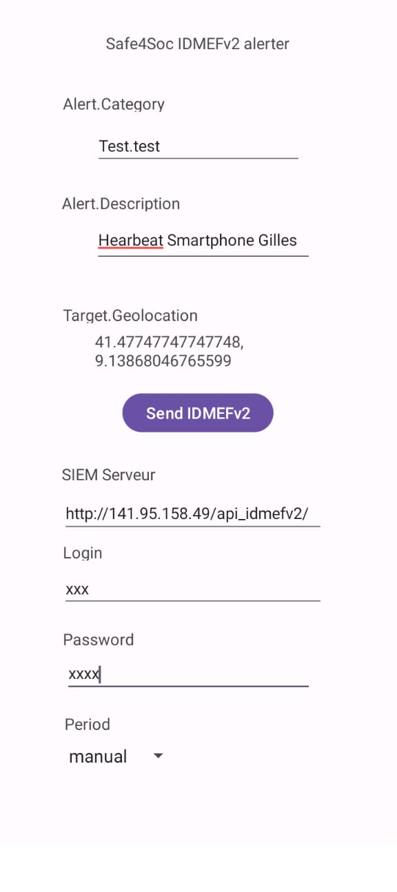

IDMEFv2 Android is a small IDMEFv2 agent Android App sending IDMEFv2 alerts through HTTPs.

The actual version is a POC that will be improved.

Prerequiite:
You will need:
- An Android phone for sending IDMEFv2 messages
- An IDMEFv2 SIEM Server for receiving IDMEFv2 messages

IDMEFv2 SIEM server: You can install your own instance of Concerto SIEM ( https://github.com/IDMEFv2/IDMEFv2-prototype) or send messages to the IDMEfv2 prototype online if you have the necessary credential (use IDMEFv2 mailing list https://www.freelists.org/list/idmefv2 to obtain credentials)

Configuration:
- Alert.Category: Test.test     # Should not be modified
- Alert.Description: Heartbeat Smarphone XXX     ### replace XXX by your name or pseudo
- Target Geolocation : ....   # Should display your actual location
- SIEM Serveur: http://141.95.158.49/api_idmefv2/    # Url of the SIEM server, leave default if using the IDMEFv2 online prototype.
- Login: xxxx # If your web serveur is protected with authentification (different from the SIEM authentication)
- Password: xxxx # Authentication password
- Period: Leave "Manual" for one shot message or choose a periodic sending

# Application on ANDROID

# Alert in Concerto

