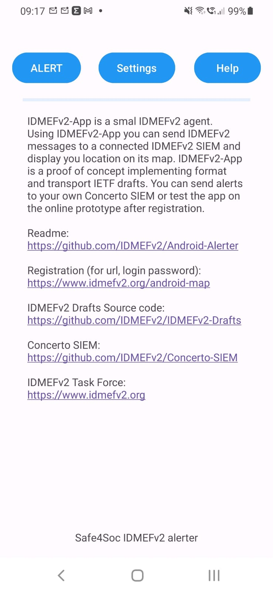

IDMEFv2 Android is a small IDMEFv2 agent Android App sending IDMEFv2 alerts through HTTPs.

The actual version is a POC that will be improved.

Prerequiite:
You will need:
- An Android phone for sending IDMEFv2 messages
- An IDMEFv2 SIEM Server for receiving IDMEFv2 messages

IMPORTANT: If app already installed, it's safer for the moment to desinstall instead of upgrading (not fully tested)

IDMEFv2 SIEM server: You can install your own instance of Concerto SIEM ( https://github.com/IDMEFv2/IDMEFv2-prototype) or send messages to the IDMEfv2 prototype online if you have the necessary credential (use IDMEFv2 mailing list https://www.freelists.org/list/idmefv2 to obtain credentials)

With the Android App you can send alerts to a central IDMEFv2 SIEM either manualy or perdiocicaly sending your location and few other informations.

Settings:
- User Name: your name or pseudo
- Target.Category: New target attribute defining the category of target. For the POC only mobile target for the moment
- URL: SIEM API receiving IDMEFv2 alerts through IDMEFv2
- Login/Password: Authentication

Alert:
- No problem / I need help: will appear in Alert.Descripion 
- Priority: IDMEFv2 alert priority
- Mode: Sending mode (manual or periodic), edit mode is "manual" with possibility to modify geolocation
- Latitude and longitude
- Notes: Note attribute
- Send IDMEFv2: Sends the alert to the specified server
- Phone map: Access to the map on the centralized Concerto SIEM (join mailing list for credentials)

Known bugs / limitations:
- Modification are not saved on app when closing
- geolocation goes unknown when phone goes in standby mode

# Application on ANDROID

# Alert in Concerto

# Phone map 

