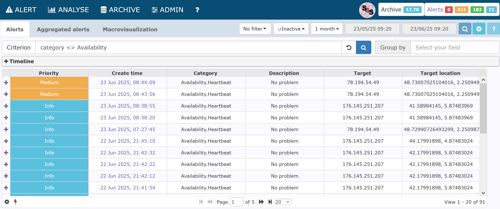

IDMEFv2 Android Alerter is a small IDMEFv2 agent Android App sending IDMEFv2 alerts through HTTPs.

The actual version is a POC that will be improved. The objective is to test the use of live geolocation in a moving asset and also confirm IDMEFv2 is quite easy to implement anywhere.

Prerequiite:
- An Android phone for sending IDMEFv2 messages
- An IDMEFv2 SIEM Server for receiving IDMEFv2 messages

IMPORTANT: If app already installed, it's safer for the moment to desinstall instead of upgrading (not fully tested)

IDMEFv2 SIEM server: You can install your own instance of Concerto SIEM ( https://github.com/IDMEFv2/IDMEFv2-prototype) or send messages to the IDMEfv2 Task Force prototype online if you have the necessary credential (use IDMEFv2 mailing list https://www.freelists.org/list/idmefv2 to obtain credentials)

With the IDMEFv2 Alerter you can send alerts to a IDMEFv2 SIEM either manualy or perdiocicaly. It will send your location and few other informations.

Be sure to configure location access in Android for the IDMEFv2 App.

By default the app is pre-configured so after installation just push the "Send IDMEFv2" button and ot should work, but you can customized your message.

Settings:
- User Name: your name or pseudo
- Target.Category: New target attribute defining the category of target. For the POC only mobile target for the moment
- URL: SIEM API receiving IDMEFv2 alerts through IDMEFv2
- Login/Password: Authentication

Alert:
- No problem / I need help: will appear in Alert.Descripion 
- Priority: IDMEFv2 alert priority
- Mode: Sending mode (manual or periodic), edit mode is "manual" with possibility to modify geolocation
- Latitude and longitude
- Notes: Note attribute
- Send IDMEFv2: Sends the alert to the specified server
- Phone map: Access to the map on the centralized Concerto SIEM (join mailing list for credentials)

Known bugs / limitations:
- Modification are not saved on app when closing
- geolocation goes unknown when phone goes in standby mode

# Application on ANDROID

# Alert in Concerto

# Phone map 

